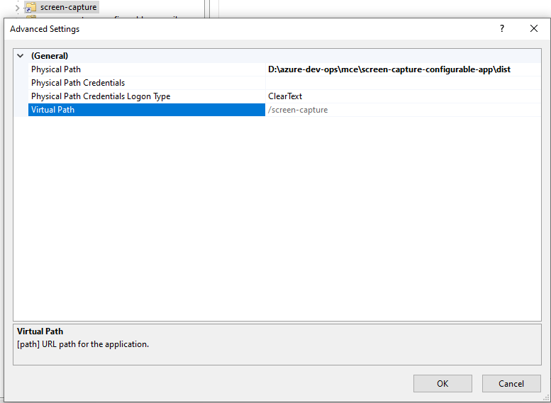
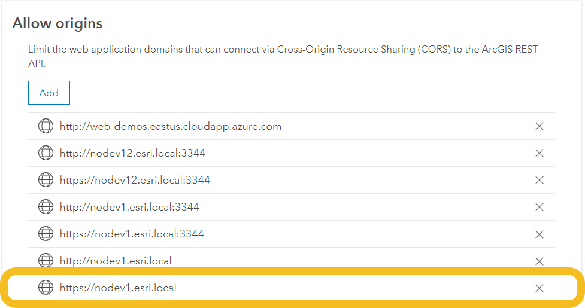
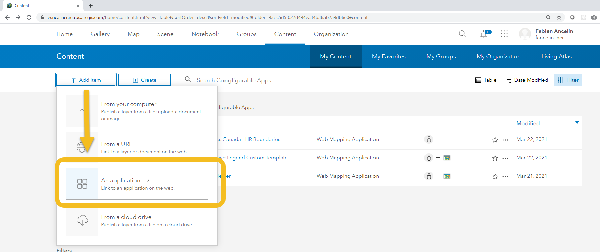
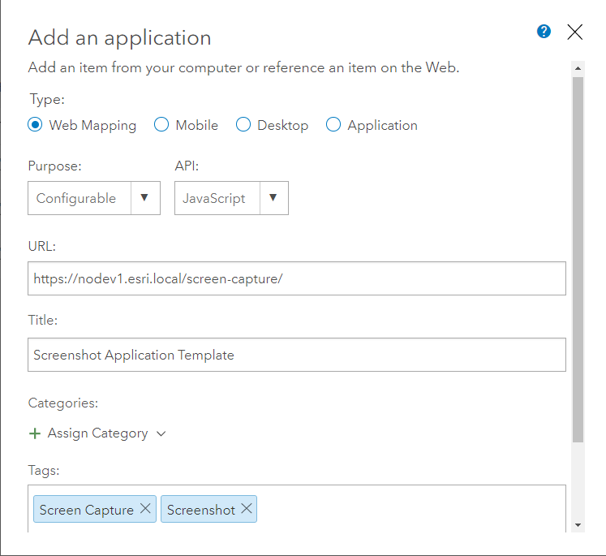
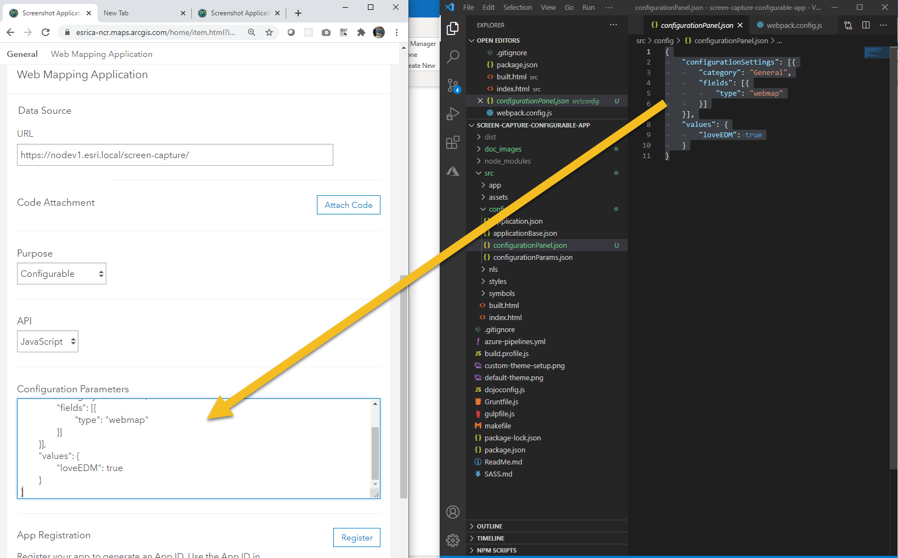
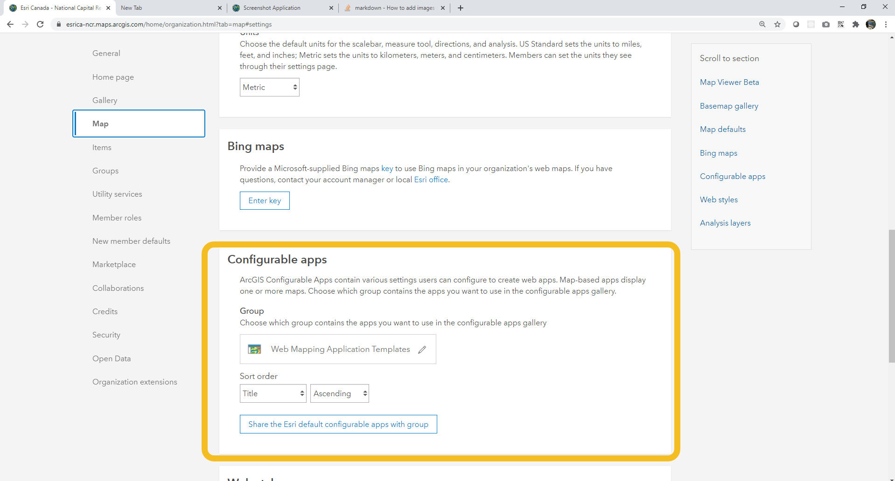
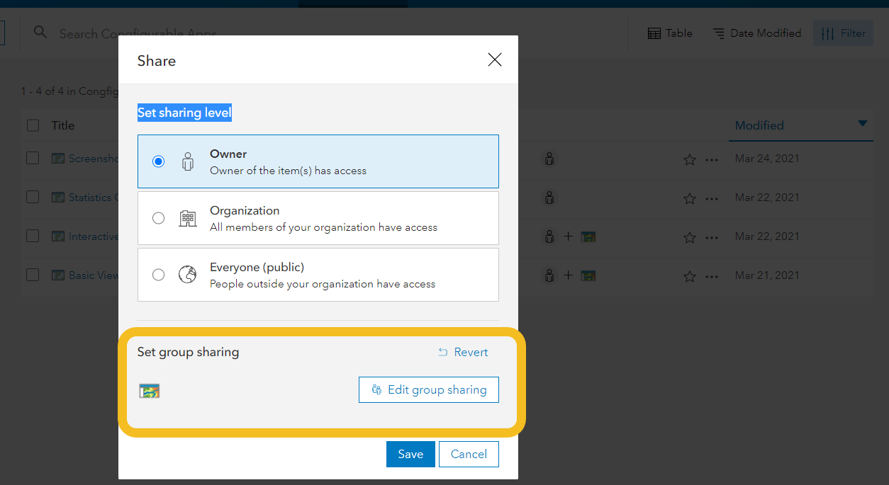
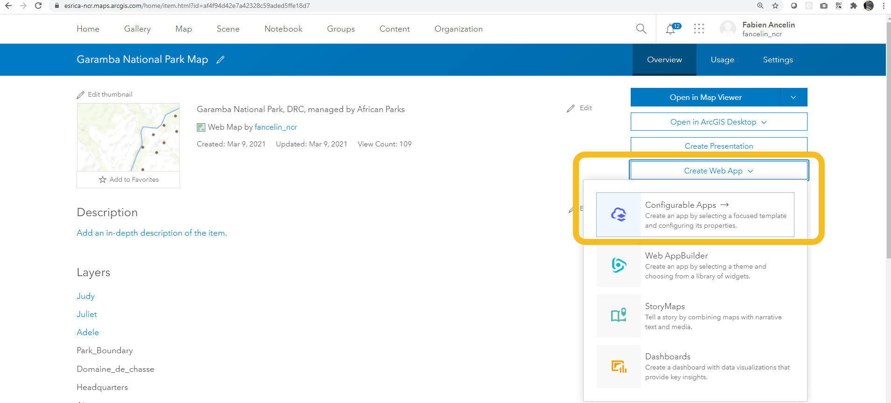
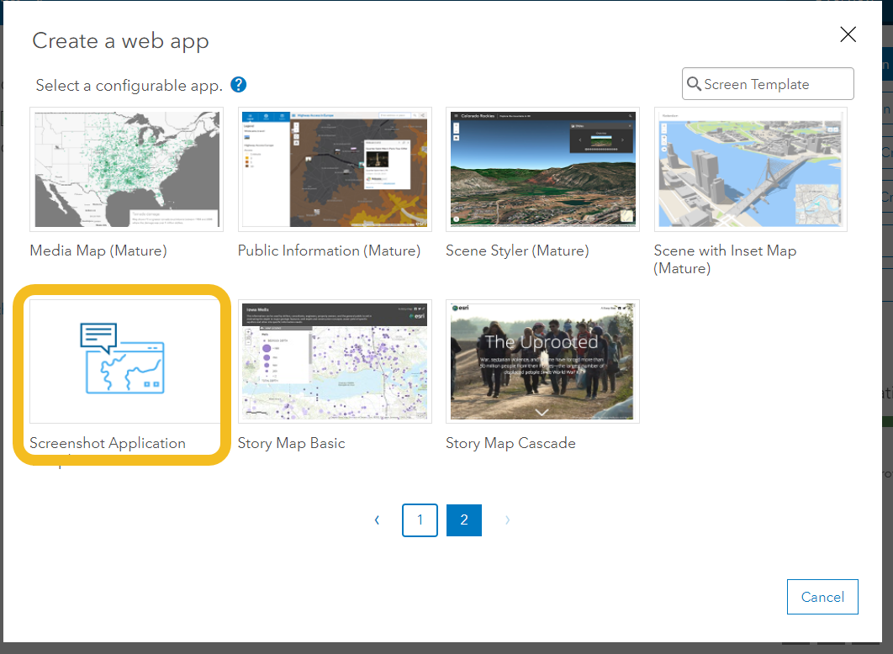
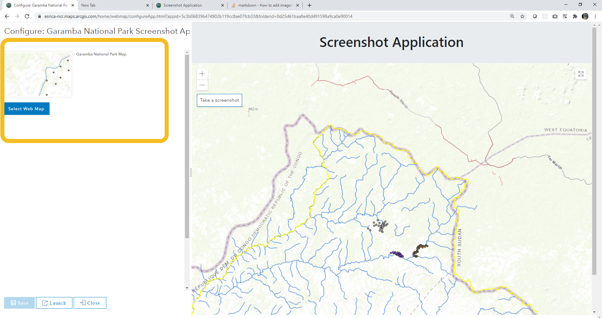

# Description

This project provides a configurable application meant to be exposed via ArcGIS Enteprise or ArcGIS Online.

# Build the code

# Requirements

You will need:

 - NodeJS V 12.x.x
 - Access to a web server.

Since Portal / ArcGIS Online will be redirecting users using your template to your web server, make sure that you're using a public / organization wide URL.

# Install project dependencies

 - Open a command prompt
 - Navigate to the root folder that contains this ReadMe file using the command `cd pathToDir`
 - Type the command: `npm install`

# Build the application.

The build process will minimize and bundle the code from the subdirectory `src` to the subdirectory `dist`. In order to run the build process, run the following command: `npm run build`

# Deploy the template

## Download and deploy in IIS

This setup assumes IIS is used as a web server. Download the code and make a virtual directory in IIS's default website. The physical path associated with your default directory should point to the subfolder `dist`.

## Add template to ArcGIS Enterprise / ArcGIS Online

### Add CORS Rules (Not always required)

You will need to make sure that the web server you're using is listed as authorized for CORS request in ArcGIS Online / Portal. This is done by logging in as an administrator and going to the following:

1. In the menu, go to `Organization`
2. In the organization submenu, go to `Settings`
3. In the left menu go to `Security`

Here is an example for the site deployed on my machine at https://nodev1.esri.local/screen-capture/

### Add template to your AGOL / Portal

In ArcGIS Online, go to your content, and add an item. 

Once your template has been added, you should see the web page describing the item. Go to the tab `Settings`. Then copy the content of the file `src/config/configurationPanel.json` into the following text box.

### Share your configurable application template

Then make sure the template shared with the group used to expose configurable application to your ArcGIS organization. If you're an admin, you can find out which group it is by doing the following. Otherwise, contact your admin to get that information if you don't have it.

Once you have that information, share your template.

### Use the template

We're going to use an example to show how to use the app. In our case we have a web map.

Then we're going to search for our application template.

If you did not forget to add the configuration text in your app template settings, you will now see you app in configuration mode. You can modify your web map.

